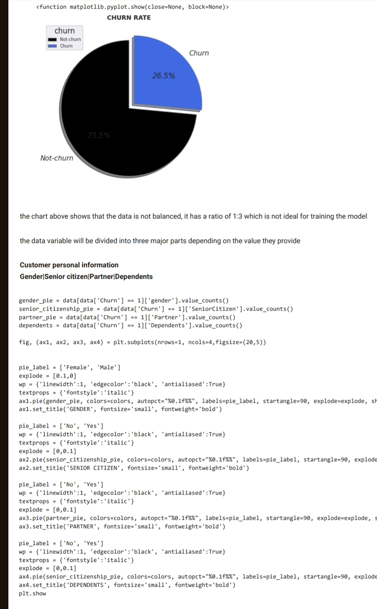
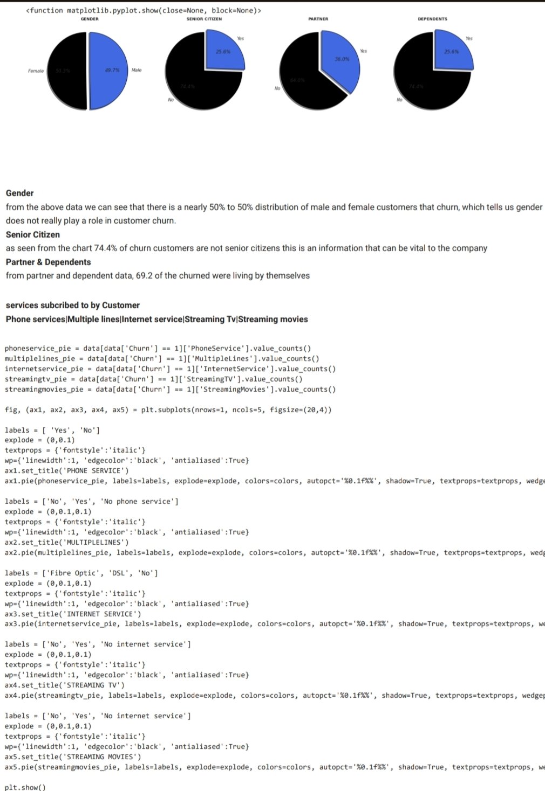
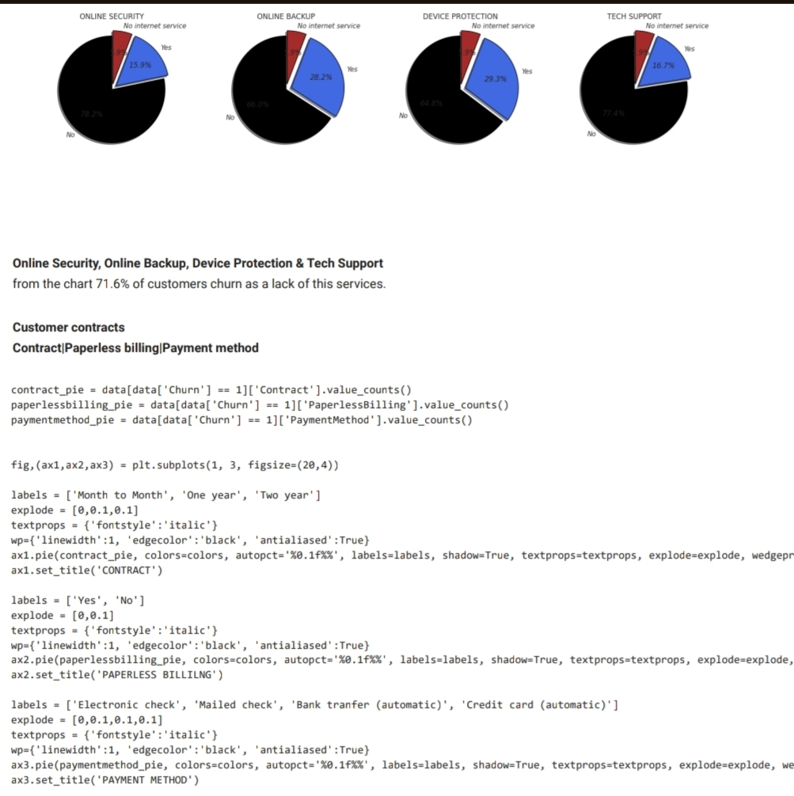
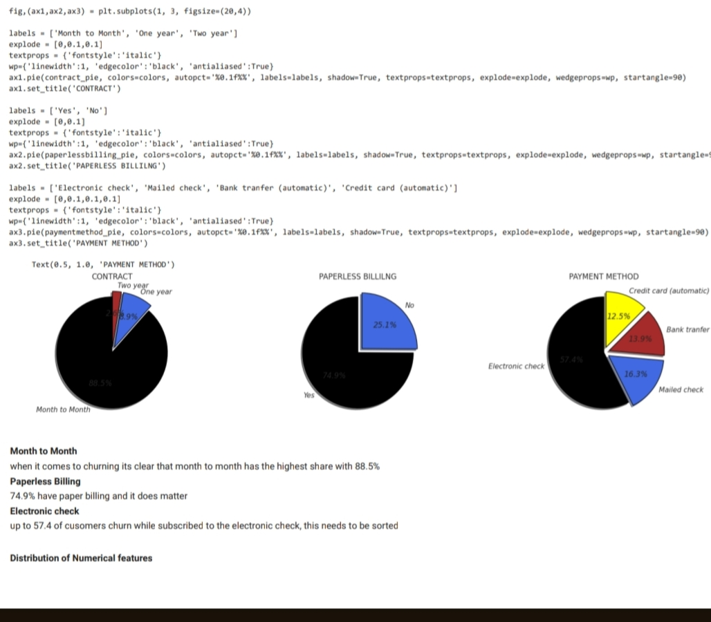
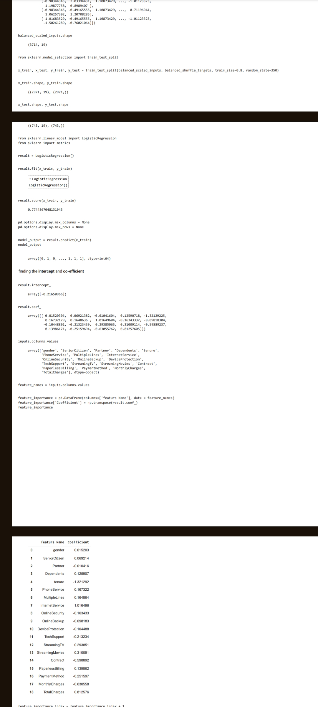
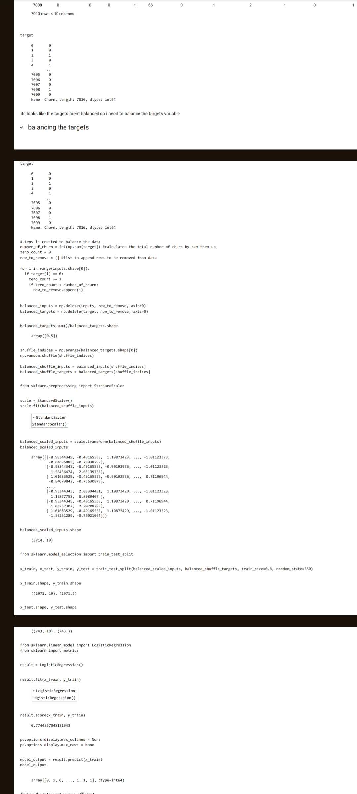
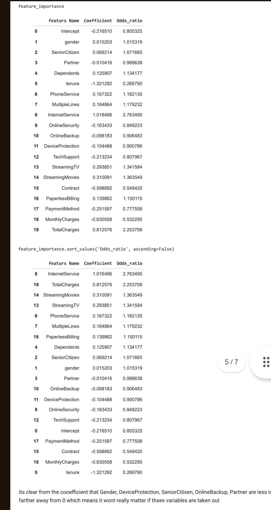

# Telecom-customer-churn-preduction- 
### Project Description 
The Telecom Customer Churn Predictor is a data science project
aimed at predicting customer churn in the telecommunications industry. 
Leveraging machine learning techniques, this project utilizes logistic 
regression to predict whether a customer is likely to churn, providing 
valuable insights for retention strategies. The project also includes 
data visualization using Matplotlib and Seaborn to explore the dataset, 
feature importance analysis, and predictive analysis. 
### Skills Utilized 
Machine Learning 
Jupyter Notebook 
Python 
Logistic Regression 
Matplotlib 
Seaborn 
Data Visualization 
Data Cleaning 
Data Preprocessing 
Predictive Analysis 
Problem Solving 
Critical Thinking 
### Key Features 
Utilizes logistic regression to predict customer churn.
Displays the probability of customer churning.
Provides feature importance analysis of the variables. 
### Project Images 
#### Charts

#### Code snippet 

#### feature importance 

[Insert image of result obtained after training the model here] 
### Dataset Used 
The project uses [dataset name] for analysis. The dataset contains 
[description of dataset]. 
### Result Obtained 
After training the model, the project achieved 
[accuracy/precision/recall] of [result]% on the test dataset. 
 
Feel free to customize the content and formatting as needed for your
GitHub readme documentation. Let me know if you need further assistance!
